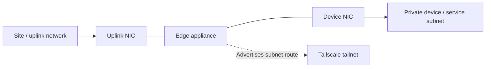

# Tailscale edge provisioner

A small Go CLI for creating a one-time Tailscale enrollment key, joining an edge appliance, and verifying the resulting device and advertised subnet.

## Background

This repository is a from-scratch reference implementation for provisioning a Linux edge device into a Tailscale network.

The example topology uses an edge appliance with an uplink interface and a separate private network containing devices or services that should be reachable remotely. The edge node joins the tailnet and advertises that private network as a subnet route.

The project is inspired by networking and edge-device provisioning problems I have worked on professionally, but all code, identifiers, network ranges, configuration, and architecture shown here were created specifically for this sample. It contains no former-employer source code, customer information, credentials, or proprietary configuration.

### Reference topology



The subnet shown in the examples is synthetic. Address allocation and device-level network configuration are outside the scope of this tool.

## What this sample does

The `edge-provisioner` CLI:

- uses the Tailscale API to issue a short-lived, one-use enrollment key
- joins a Linux edge device using the installed Tailscale CLI
- applies a small amount of synthetic device identity metadata
- advertises one or more private subnet routes
- verifies that the expected device registered
- verifies that the expected routes are being advertised
- leaves subnet-route approval to an operator

The sample uses one `tag:edge`. Client, site, device, environment, and hostname values provide naming context rather than separate access-control boundaries.

It does not configure downstream devices, allocate address space globally, configure DNS, approve routes automatically, or manage a fleet.

## Requirements

- Go 1.24 or later to build, run, or test
- `tailscaled` and `tailscale` installed on the appliance
- Linux IP forwarding enabled before using subnet routing
- `tag:edge` defined and authorized by the tailnet policy
- an OAuth client for operator-side API access

For operator commands, set:

```sh
export TS_TAILNET='example.com'
export TS_CLIENT_ID='your-client-id'
export TS_CLIENT_SECRET='your-client-secret'
```

The OAuth client needs the `auth_keys` and `devices:core:read` scopes and permission to create keys carrying `tag:edge`.

OAuth credentials stay on the operator system. They are not required on the appliance.

Relevant Tailscale documentation:

- [OAuth clients](https://tailscale.com/docs/features/oauth-clients)
- [Subnet routers](https://tailscale.com/kb/1019/subnets)
- [`tailscale up`](https://tailscale.com/docs/reference/tailscale-cli/up)
- [Tailscale API](https://api.tailscale.com/api/v2)

## Build and test

```sh
go build -o edge-provisioner ./cmd/edge-provisioner
go test ./...
go vet ./...
```

The test suite does not require real credentials or live Tailscale services.

## Provisioning flow

### 1. Issue a one-time enrollment key

Run `issue-key` from the operator system:

```sh
./edge-provisioner issue-key --out ./edge.key
```

The generated key is short-lived and single-use. The file is created with restrictive permissions and should be transferred to the target appliance through an appropriate secure channel.

### 2. Join the edge appliance

On the appliance:

```sh
sudo ./edge-provisioner join \
  --key-file ./edge.key \
  --client demo --site yard --device gateway1 \
  --environment demo --hostname edge \
  --routes 192.168.42.0/27
```

The identifiers and subnet above are synthetic.

The derived hostname joins the identity labels with `--`. Labels may contain single hyphens but not `--`, and the final hostname must fit within 63 characters.

Advertised routes must be canonical RFC 1918 IPv4 CIDRs in the range accepted by the CLI.

### 3. Verify registration and route advertisement

After the device has registered, run `verify` from the operator system:

```sh
./edge-provisioner verify \
  --client demo --site yard --device gateway1 \
  --environment demo --hostname edge \
  --routes 192.168.42.0/27
```

Verification checks that the expected device exists and that it reports the requested subnet route.

### 4. Approve the subnet route

Route advertisement and route approval are separate states.

The tool intentionally does not approve routes automatically. An operator must approve the advertised route in the Tailscale admin console before clients can use it.

## DNS

The hostname assigned to the edge appliance identifies that node on the tailnet.

That does not automatically provide names for services behind an advertised subnet. Friendly names for downstream resources require an appropriate DNS design, such as a reachable resolver and tailnet DNS policy.

DNS configuration is intentionally outside the scope of this sample.

See:

- [MagicDNS](https://tailscale.com/docs/features/magicdns)
- [Split DNS policies](https://tailscale.com/docs/features/split-dns-policies)

## Development workflow

This public implementation was built with AI coding agents from a written project brief.

The project is based on networking and edge-device provisioning problems I have worked on professionally. No former-employer source code or proprietary configuration was used.
