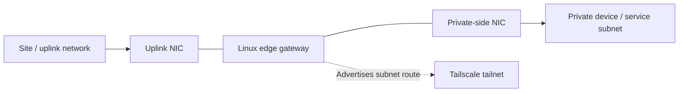

# Tailscale Edge Provisioner

A small Go CLI for provisioning Linux edge gateways into a Tailscale network, advertising private subnet routes, and verifying the resulting device and route state.

I use Tailscale extensively in my own network and wanted a repeatable way to experiment with edge gateways that sit between an uplink network and devices or services on a private subnet. The same pattern is useful for homelabs, IoT setups, remote sites, and other environments where downstream devices cannot or should not run a Tailscale client themselves.

## Reference topology


```mermaid
flowchart LR
    uplink[Site / uplink network] --> nic1[Uplink NIC]
    nic1 --- edge[Linux edge gateway]
    edge --- nic2[Private-side NIC]
    nic2 --> private[Private device / service subnet]
    edge -. "Advertises subnet route" .-> tailnet[Tailscale tailnet]
```

The addresses and identifiers used in the examples are intentionally generic. Address allocation and configuration of downstream devices are outside the scope of this project.

## What it does

The `edge-provisioner` CLI supports a small provisioning workflow:

- create a short-lived, single-use Tailscale auth key through the API
- join a Linux edge gateway using the installed Tailscale CLI
- assign a predictable hostname derived from provisioning metadata
- advertise one or more private subnet routes
- verify that the expected device registered in the tailnet
- verify that the expected subnet routes are being advertised
- leave subnet-route approval as an explicit operator action

The current implementation uses a single `tag:edge` tag. The client, site, device, environment, and hostname values are used for naming and identification; they are not separate access-control boundaries.

## Non-goals

This project intentionally stays small. It does not currently:

- configure downstream devices
- allocate site address space
- configure DNS for services behind an advertised subnet
- approve subnet routes automatically
- manage an entire fleet or desired-state inventory
- install or configure `tailscaled` itself

Those concerns are useful extensions, but keeping them outside the CLI makes the provisioning path easier to reason about and test.

## Requirements

- Go 1.24 or later to build, run, or test
- Linux on the edge gateway
- `tailscaled` and `tailscale` installed on the gateway
- IP forwarding enabled before using subnet routing
- `tag:edge` defined and authorized in the tailnet policy
- a Tailscale OAuth client for operator-side API access

For operator commands, set:

```bash
export TS_TAILNET='example.com'
export TS_CLIENT_ID='your-client-id'
export TS_CLIENT_SECRET='your-client-secret'
```

The OAuth client needs the `auth_keys` and `devices:core:read` scopes and permission to create auth keys carrying `tag:edge`.

OAuth credentials stay on the operator system. They are not required on the edge gateway.

## Build and test

```bash
go build -o edge-provisioner ./cmd/edge-provisioner
go test ./...
go vet ./...
```

The test suite does not require real Tailscale credentials or access to a live tailnet.

## Provisioning flow

### 1. Issue an enrollment key

Run `issue-key` from the operator system:

```bash
./edge-provisioner issue-key --out ./edge.key
```

The generated auth key is short-lived and single-use. The file is written with restrictive permissions and should be transferred to the target gateway through an appropriate secure channel.

### 2. Join the edge gateway

On the gateway:

```bash
sudo ./edge-provisioner join \
  --key-file ./edge.key \
  --client demo \
  --site yard \
  --device gateway1 \
  --environment demo \
  --hostname edge \
  --routes 192.168.42.0/27
```

The derived hostname joins the identity labels with `--`. Labels may contain single hyphens but not `--`, and the final hostname must fit within 63 characters.

Advertised routes must be canonical RFC 1918 IPv4 CIDRs accepted by the CLI.

### 3. Verify registration and advertised routes

After the gateway has registered, run `verify` from the operator system:

```bash
./edge-provisioner verify \
  --client demo \
  --site yard \
  --device gateway1 \
  --environment demo \
  --hostname edge \
  --routes 192.168.42.0/27
```

Verification checks that the expected device exists in the tailnet and reports the requested subnet route.

### 4. Approve the subnet route

Route advertisement and route approval are separate states.

This tool deliberately does not approve routes automatically. An operator must approve the advertised route in the Tailscale admin console before clients can use it.

## Security notes

A few choices in the project are deliberately conservative:

- OAuth credentials remain on the operator side rather than being copied to edge gateways.
- Enrollment keys are short-lived and single-use.
- Key files are expected to have restrictive permissions.
- Secret values and API response bodies should not be exposed through logs or error messages.
- API-facing code is kept behind a small boundary so it can be tested against local HTTP servers instead of live credentials.

This is still a hobby project, not a complete device-management platform. Review the implementation and your tailnet policy before using it in an environment where the gateway protects sensitive resources.

## DNS

The hostname assigned to the edge gateway identifies that node on the tailnet. It does not automatically provide names for services behind an advertised subnet.

Friendly names for downstream resources need a separate DNS design, such as a reachable resolver combined with tailnet DNS policy. MagicDNS and split DNS can be useful depending on the topology.

DNS configuration is outside the current scope of this project.

## Tailscale documentation

- [OAuth clients](https://tailscale.com/docs/features/oauth-clients)
- [Subnet routers](https://tailscale.com/docs/features/subnet-routers)
- [`tailscale up`](https://tailscale.com/docs/reference/tailscale-cli/up)
- [Tailscale API](https://api.tailscale.com/api/v2)
- [MagicDNS](https://tailscale.com/docs/features/magicdns)
- [Split DNS policies](https://tailscale.com/docs/features/split-dns-policies)
